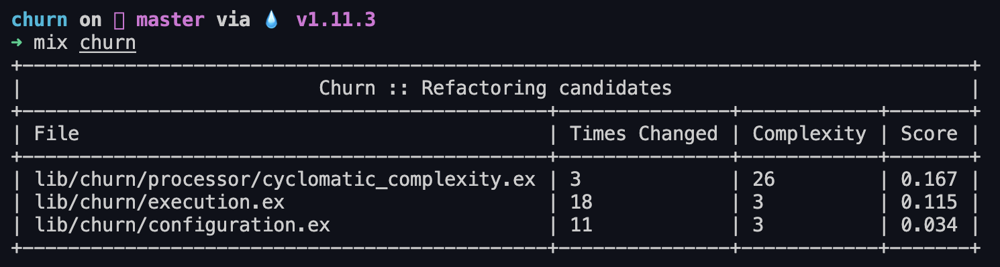

# Churn [](https://github.com/patrykwozinski/churn/actions) [](https://hex.pm/packages/churn)

**Discover refactoring candidates by identifying the most frequently-edited files with the highest cyclomatic complexity**

## Table of Contents
* [What Is it?](#what-is-it)
* [How to Use?](#how-to-use)
* [How to Install?](#how-to-install)
* [Understanding Churn Scores](#understanding-churn-scores)
* [Similar Packages](#similar-packages)

## What is it?
`churn` is a package that helps you identify `.ex` and `.exs` files in your project that could be good candidates for refactoring. It examines each Elixir file in the path it is provided and:
* Checks how many commits it has.
* Calculates the cyclomatic complexity.
* Creates a score based on these two values.

The results are displayed in a table:


## How to use

After installing, run `mix churn`.

You can use these options to customize how Churn runs:

```sh
--min-score-to-show (-s shortcut)

Example:
mix churn -s 2
```

```sh
--commit-since (-t shortcut)

Example:
mix churn -t "2 months ago"
```

```sh
--directories-to-scan (-d shortcut)

Example:
-d lib,test
```

```sh
--file-extensions [-e shortcut]

Example
mix churn -e "ex,exs"
```

```sh
--files-to-ignore [-i shortcut]

Example
mix churn -i "lib/churn/hello_world.ex"
```

```sh
--config [-c shortcut]

Example
mix churn -c foo/bar.exs
```

## How to install

The package can be installed by adding `churn` to your list of dependencies in `mix.exs` as follows.
You also need to copy [`.churn.exs`](.churn.exs) into your project.

Update your `mix.exs`:
```elixir
def deps do
  [
    {:churn, "~> 0.1", only: :dev}
  ]
end
```

Copy and configure the `.churn.exs` file:
```elixir 
%{
  #
  # Minimum score to show in the output table.
  #
  min_score_to_show: 0,

  #
  # Specify when to look for commits. (This string is passed to `git rev-list
  # --since [value]`, so any human-readable string it understands is
  # acceptable.)
  #
  commit_since: "1 year ago",

  #
  # Describes output type for the Churn results
  #
  output_type: :console,

  #
  # Where to find files to analyse and look for refactoring candidates.
  #
  directories_to_scan: ["lib"],

  #
  # Which extensions should be used for seeking files to analyse.
  #
  file_extensions: ["ex", "exs"],

  #
  # Determines files should we ignore and protect from analysis.
  #
  files_to_ignore: []
}
```

## Understanding Churn Scores

Churn will always identify top-scoring files.
Also, all scores produced by Churn are **relative to the project**.

For example, in a newly-generated Mix project, with a simple `HelloWorld` module, that file will be scored `1.0` and be listed as the sole refactoring candidate.
In any real project, the same module would have a very low score.

On the other hand, in a project where every module is complex and frequently-modified, some modules may receive low scores which would receive high scores if they were part of a different project.

When you see the results Churn produces, consider them the most likely refactoring candidates **for this project**.
Whether they actually need refactoring is up to you.

Docs: [https://hexdocs.pm/churn](https://hexdocs.pm/churn).

## Similar Packages
* https://github.com/danmayer/churn (Ruby)
* https://github.com/chad/turbulence (Ruby)
* https://github.com/bmitch/churn-php (PHP)
